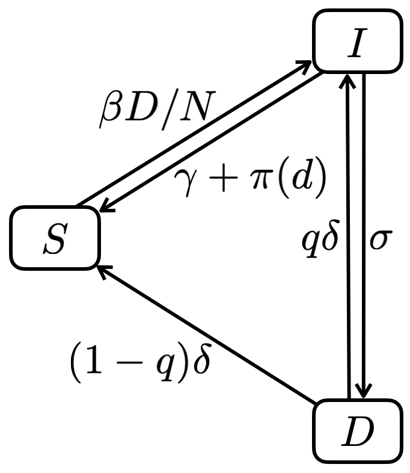

```{r setup, include = FALSE}
knitr::opts_chunk$set(echo = TRUE)
```

## Packages

```{r}
library(tibble)
library(deSolve)
```

## Functions

```{r}
lwd_val <- 2
```

```{r}
seq2 <- function(...) seq(..., le = 512)
```

```{r}
plot2 <- function(..., col = 4) plot(..., type = "l", lwd = lwd_val, col = col)
```

```{r}
lines2 <- function(..., col = 2) lines(..., lwd = lwd_val, col = col)
```

```{r}
legend2 <- function(...) legend(..., lty = 1, lwd = lwd_val, bty = "n")
```

```{r}
abline2 <- function(...) abline(..., lwd = lwd_val)
```


## Model

### Assumptions

* frequency-dependence transmission
* no immunity against TB
* no mortality
* constant population size
* distribution of stay in infected non-disease state ($I$) follows an
exponential distribution (see section on parameters)

### Epidemiological framework

<div style="text-align:center"></div>

#### Parameters


* $N$: population size (ind)
* $\beta$: per capita infectious contact rate (/year/ind)
* $\gamma$: per capita rate of clearance of non-diseased (/year)
* $\delta$: per capita rate of clearance of diseased (/year)
* $\sigma$: per capita rate of developing disease once infected (/year)
* $p(d)$: probability of successfully treating non-diseased infected

**Note:** we assume that the duration of stay in the infected non-disease state
follows an exponential distribution. This means that we can express the rate as
a function of the proportion $q$ of people we expect to develop disease before
$x$ years:

$$
\sigma = -\frac{\log(1 - q)}{x}
$$

```{r}
exp_rate <- function(x, q) {
  - log(1 - q) / x
}
```

For 90% of infected people developing the disease within 2 years, we then want
$\sigma$ to be equal to:

```{r}
exp_rate(2, .9)
```

We'll how we can derive values of the other parameters from equilibrium values
(see section on equilibrium below).

#### Epidemiological dynamics:

$$
\frac{dS}{dt} = \gamma I + \delta D - (1-p(d))\beta\frac{D}{N}S
$$

$$
\frac{dI}{dt} = (1-p(d))\beta\frac{D}{N}S - (\gamma + \sigma) I
$$

$$
\frac{dD}{dt} = \sigma I - \delta D
$$

#### Constant population size:

$$
N = S + I + D
$$

#### Equilibrium 

$$
S^* = \frac{1+\gamma/\sigma}{(1 - p(d))\beta}\delta N
$$

$$
I^* = \frac{(1-p(d))\beta -
(1+\gamma/\sigma)\delta}{(\sigma+\delta)(1-p(d))\beta}\delta N
$$

$$
D^* = \frac{(1-p(d))\beta - (1+\gamma/\sigma)\delta}
{(1+\delta/\sigma)(1-p(d))\beta}N
$$

#### Numerical verification

The model in R:

```{r}
model <- function(S0, I0, D0, beta, sigma, gamma, delta, p, times) {
  N <- S0 + I0 + D0
  ode(
    c(S = S0, I = I0, D = D0),
    times,
    function(time, state, pars) {
      with(as.list(c(state, pars)), {
        infections <- (1 - p) * beta * D * S / N
        recoveries <- delta * D
        dS <- gamma * I  + recoveries - infections
        dI <- infections - (sigma + gamma) * I
        dD <- sigma * I - recoveries
        list(c(dS, dI, dD))
      })
    },
    c(beta = beta, sigma = sigma, gamma = gamma, delta = delta, p = p)
  ) |>
    as.data.frame() |> 
    as_tibble()
}
```

The equilibrium values in R:

```{r}
s_star <- function(gamma, sigma, delta, beta, p, N) {
  (1 + gamma / sigma) * delta * N / ((1 - p) * beta)
}

i_star <- function(gamma, sigma, delta, beta, p, N) {
  N * delta * ((1 - p) * beta - (1 + gamma / sigma) * delta) / 
    ((1 + delta / sigma) * (1 - p) * beta * sigma)
}

d_star <- function(gamma, sigma, delta, beta, p, N) {
  N * ((1 - p) * beta - (1 + gamma / sigma) * delta) / 
    ((1 + delta / sigma) * (1 - p) * beta)
}
```

Let's compare:

```{r fig.width = 7, fig.height = 5 / 2}
S0 <- 1e6 - 10 # ind
I0 <- 0 # ind
D0 <- 10 # ind
beta <- 1 # /year/ind
sigma <- 1.15 # /year
gamma <- .1 # /year
delta <- .1 # /year
p <- 0 # in absence of treatment

sims <- model(S0, I0, D0, beta, sigma, gamma, delta, p, seq2(0, 50))

plot3 <- function(...) plot2(..., xlab = "time (years)")
abline3 <- function(...) abline2(..., col = 2)
N <- S0 + I0 + D0

opar <- par(mfrow = c(1, 3))
with(sims, plot3(time, S, ylab = "susceptibles S"))
abline3(h = s_star(gamma, sigma, delta, beta, p, N))
with(sims, plot3(time, I, ylab = "infected non-diseased I"))
abline3(h = i_star(gamma, sigma, delta, beta, p, N))
with(sims, plot3(time, D, ylab = "diseased D"))
abline3(h = d_star(gamma, sigma, delta, beta, p, N))
par(opar)
```


#### Estimating $\beta$, $\gamma$ and $\delta$

```{r}
sigma_val <- exp_rate(2, .9)
s_star2 <- function(...) s_star(sigma = sigma_val, p = 0, N = 1)
i_star2 <- function(...) i_star(sigma = sigma_val, p = 0, N = 1)
d_star2 <- function(...) d_star(sigma = sigma_val, p = 0, N = 1)
```

```{r}

```


## Duration of prophylactic treatment

```{r}
tau <- function(d, K, h) {
  K^h / (K^h + d^h)
}
```

```{r}
epsilon <- function(d, L, l) {
  d^l / (L^l + d^l)
}
```


```{r}
ds <- seq2(0, 180) # days
K <- 45 # days
h <- 4
L <- 90 # days
l <- 1

plot2(ds, tau(ds, K, h), xlab = "duration of treatment (days)",
      ylab = "probability")

lines2(ds, epsilon(ds, L, l))

lines2(ds, tau(ds, K, h) * epsilon(ds, L, l), col = 3)

legend2("topright", legend = c("adherence to treatment", "treatment efficiency",
                               "adherence to treatment x treatment efficiency"),
        col = c(4, 2, 3))

abline(h = .5)
```
