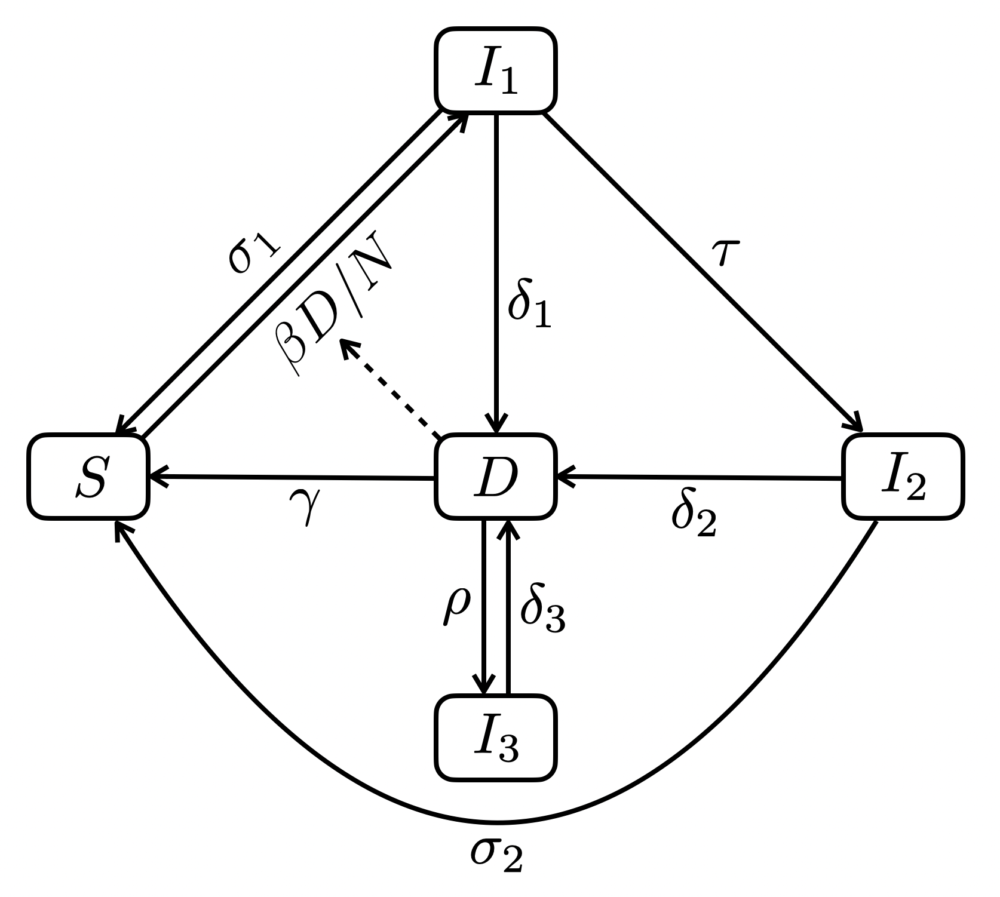

```{r setup, include = FALSE}
knitr::opts_chunk$set(echo       = TRUE,
                      cache      = TRUE,
                      autodep    = TRUE,
                      message    = FALSE,
                      warning    = FALSE,
                      dev.args   = list(pointsize = 11),
                      fig.height = 3.5,
                      fig.width  = 4.24725,
                      fig.retina = 2,
                      fig.align  = "center")
```

**Variables:**

* $S$: non-infected
* $I_1$: recently infected
* $I_2$: infected a long time ago
* $I_3$: treated but not sterilized
* $D$: sick and infectious
* $N = S + I_1 + I_2 + I_3 + D$

**Parameters:**

* $\beta$: infectious contact rate (/ind/year)
* $\sigma_1$ and $\sigma_2$: clearance rates of $I_1$ and $I_2$ respectively,
either through natural immunity or prophylactic treatment
* $\delta_1$, $\delta_2$ and $\delta_3$: progression of infection to disease for
$I_1$, $I_2$ and $I_3$ (relapse) respectively
* $\gamma$: recovery with clearance either from treatment or natural immunity
* $\rho$: recovery without clearance (ultimately leading to relapse)

**Flow diagram:**

<div style="text-align:center"></div>

**Differential equations:**

$$
\begin{align} 
  \frac{dS}{dt}   &= \sigma_1 I_1 + \sigma_2 I_2 + \gamma D - \beta \frac{D}{N} S \\
  \frac{dI_1}{dt} &= \beta \frac{D}{N} S - (\sigma_1 + \delta_1 + \tau) I_1       \\
  \frac{dI_2}{dt} &= \tau I_1 - (\delta_2 + \sigma_2) I_2                         \\
  \frac{dI_3}{dt} &= \rho D - \delta_3 I_3                                        \\
  \frac{dD}{dt}   &= \delta_1 I_1 + \delta_2 I_2 + \delta_3 I_3 - (\gamma + \rho) D
\end{align}
$$
