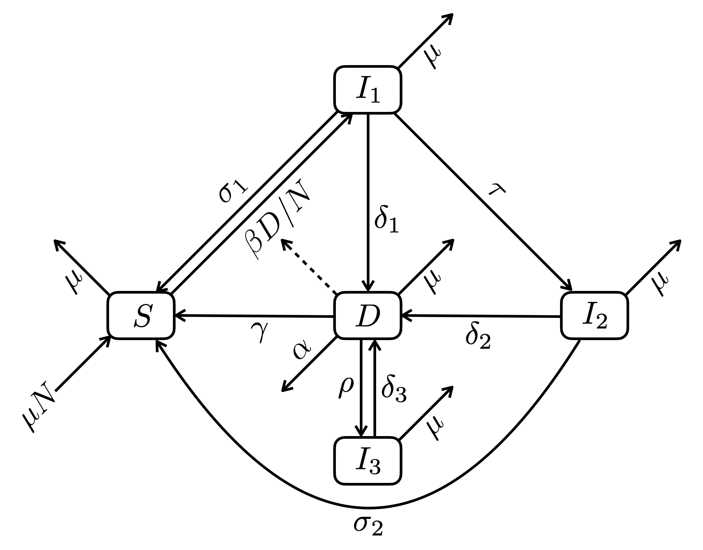

```{r setup, include = FALSE}
knitr::knit_hooks$set(
  margin1 = function(before, options, envir) {
    if (before) par(mgp = c(1.5, .5, 0), bty = "n", plt = c(.105, .97, .13, .97))
    else NULL
  },
  margin2 = function(before, options, envir) {
    if (before) par(mgp = c(1.5, .5, 0), bty = "n", plt = c(.2, .97, .2, .85))
    else NULL
  })

knitr::opts_chunk$set(margin1    = TRUE,
                      echo       = TRUE,
                      cache      = FALSE,
                      autodep    = TRUE,
                      message    = FALSE,
                      warning    = FALSE,
                      dev.args   = list(pointsize = 11),
                      fig.height = 3.5,
                      fig.width  = 4.24725,
                      fig.retina = 2,
                      fig.align  = "center")
```


## Packages

Required: `deSolve`, `tibble`

```{r}
library(tibble)
```


## Functions

```{r}
ode2 <- function(...) as_tibble(as.data.frame(deSolve::ode(...)))
```

```{r}
seq2 <- function(...) seq(..., le = 512)
```

```{r}
plot2 <- function(..., col = 4) plot(..., type = "l", lwd = 2, col = col)
```

```{r}
plot3 <- function(x, y, ...) {
  plot2(x, y, xlab = "time (years)", ylim = c(0, max(y)),
        cex.lab = 1.5, cex.axis = 1.5, ...)
}
```


## Epidemiological model

**Assumptions**

* Constant population size


**Variables:**

* $S$: non-infected
* $I_1$: recently infected
* $I_2$: infected a long time ago
* $I_3$: treated but not sterilized
* $D$: sick and infectious (we don't discriminate PTB from EPTB)
* $N = S + I_1 + I_2 + I_3 + D$


**Parameters:**

* $\beta$: infectious contact rate (/ind/year)
* $\sigma_1$ and $\sigma_2$: clearance rates (/year) of $I_1$ and $I_2$
respectively, either through natural immunity or prophylactic treatment
* $\delta_1$, $\delta_2$ and $\delta_3$: progression rates (/year) of infection
to disease for $I_1$, $I_2$ and $I_3$ (relapse) respectively
* $\gamma$: rate (/year) of recovery with clearance either from treatment or
natural immunity
* $\rho$: rate (/year) of recovery without clearance (ultimately leading to
relapse)
* $\tau$: rate (/year) at which infected transit from a status of recent
infection to a status of non-recent infection
* $\mu$: demographic turn-over rate
* $\alpha$: death rate due to TB

**Note:** all these rates are *per capita*


**Flow diagram:**

<div style="text-align:center"></div>


**Differential equations:**

$$
\begin{align} 
  \frac{dS}{dt}   &= \mu N + \sigma_1 I_1 + \sigma_2 I_2 + \gamma D - \left(\mu + \beta \frac{D}{N} \right) S \\
  \frac{dI_1}{dt} &= \beta \frac{D}{N} S - (\mu + \sigma_1 + \delta_1 + \tau) I_1       \\
  \frac{dI_2}{dt} &= \tau I_1 - (\mu + \delta_2 + \sigma_2) I_2                         \\
  \frac{dI_3}{dt} &= \rho D - (\mu + \delta_3) I_3                                        \\
  \frac{dD}{dt}   &= \delta_1 I_1 + \delta_2 I_2 + \delta_3 I_3 - (\mu + \alpha + \gamma + \rho) D
\end{align}
$$


**Endemic equilibrium:**

$$
\begin{align}
  S^*   &= \frac{(\mu + \delta_2 + \sigma_2) (\mu + \delta_1 + \sigma_1 + \tau)}
                {(\mu + \delta_2 + \sigma_2) \delta_1 + \tau \delta_2}
           \left( \frac{\mu + \delta_3 + \rho}{\mu + \delta_3} \mu + \alpha + \gamma  \right) \frac{1}{\beta} N
\end{align}
$$


**R code for the differential equations:**

```{r}
epidemiology <- function(
    S0, I10, I20, I30, D0,
    beta, sigma1, sigma2, delta1, delta2, delta3, gamma, tau, rho, mu, alpha, times) {
  
  N <- S0 + I10 + I20 + I30 + D0
  
  ode2(c(S = S0, I1 = I10, I2 = I20, I3 = I30, D = D0),
       times,
       function(time, state, pars) {
         with(as.list(c(state, pars)), {
           foi <- beta * D * S / N
           dS  <- mu * (N - S) + sigma1 * I1 + sigma2 * I2 + gamma * D - foi
           dI1 <- foi - (mu + sigma1 + delta1 + tau) * I1
           dI2 <- tau * I1 - (mu + delta2 + sigma2) * I2
           dI3 <- rho * D - (mu + delta3) * I3
           dD  <- delta1 * I1 + delta2 * I2 + delta3 * I3 - (mu + alpha + gamma + rho) * D
           list(c(dS, dI1, dI2, dI3, dD))
         })
       },
       c(beta = beta, gamma = gamma, rho = rho,
         sigma1 = sigma1, sigma2 = sigma2,
         delta1 = delta1, delta2 = delta2, delta3 = delta3,
         mu = mu, alpha = alpha))
}
```


**R code for the endemic equilibrium:**

```{r}
equilibium <- function(
    beta, sigma1, sigma2, delta1, delta2, delta3, gamma, tau, rho, mu, alpha, N) {
  A <- (mu + delta2 + sigma2) * 
       ((1 - rho / (mu + delta3)) * mu + alpha + gamma) /
       ((mu + delta2 + sigma2) * delta1 + tau * delta2)
  
  S <- (mu + delta1 + sigma1 + tau) * A * N / beta
  D <- (1 - (mu + delta1 + sigma1 + tau) * A) * N / 
       (beta * (1 + rho / (mu + delta3) + (1 + tau / (mu + delta2 + sigma2)) * A))
  I1 <- (mu + delta2 + sigma2) * (N - S - (1 + rho / (mu + delta3)) * D) /
        (mu + delta2 + sigma2 + tau)
  I2 <- N - S - I1 - (1 + rho /(mu + delta3)) * D
  c(S = S, D = D, I1 = I1, I2 = I2, I3 = N - S - D - I1 - I2)
}
```

```{r}
equilibium <- function(
    beta, sigma1, sigma2, delta1, delta2, delta3, gamma, tau, rho, mu, alpha, N) {
  S <- (mu + delta2 + sigma2) * (mu + delta1 + sigma1 + tau) *
       ((mu + delta3 + rho) * mu / (mu + delta3) + alpha + gamma) * N /
         (beta * ((mu + delta2 + sigma2) * delta1 + tau * delta2))
  D <- (N - S) / 
       (1 + rho / (mu + delta3) + (1 + tau / (mu + delta2 + sigma2)) * beta * S / ((mu + sigma1 + delta1 + tau) * N))
  c(S = S, D = D)
}
```


**Numerical verification of the equilibrium:**

The calculations:

```{r}
S0  <- 1e6 - 10 # ind
I10 <- 0 # ind
I20 <- 0 # ind
I30 <- 0 # ind
D0  <- 10 # ind

beta   <- 1 # /year/ind
sigma1 <- .1 # /year
sigma2 <- .1 # /year
delta1 <- 1.15 # /year
delta2 <- .1 # /year
delta3 <- .1 # /year
gamma  <- .1 # /year
tau    <- .5 # /year
rho    <- .05 # /year
mu     <- .02 # /year
alpha  <- .03 # /year

dynamics <- epidemiology(S0, I10, I20, I30, D0,
                         beta, sigma1, sigma2, delta1, delta2, delta3,
                         gamma, tau, rho, mu, alpha, seq2(0, 200))

statics <- equilibium(beta, sigma1, sigma2, delta1, delta2, delta3,
                      gamma, tau, rho, mu, alpha, S0 + I10 + I10 + I10 + D0)
```

```{r}
statics
```


The vizualization:

```{r fig.height = 3.5, fig.width  = 1.5 * 4.24725, margin1 = FALSE, margin2 = TRUE}
opar <- par(mfrow = 2:3)
with(dynamics, {
  plot3(time, I1, ylab = "I1")
  plot3(time, I2, ylab = "I2")
  plot3(time, I3, ylab = "I3")
  plot3(time, S , ylab = "S")
  abline(h = statics["S"], col = 2, lwd = 2)
  plot3(time, D , ylab = "D")
  abline(h = statics["D"], col = 2, lwd = 2)
})
par(opar)
```
